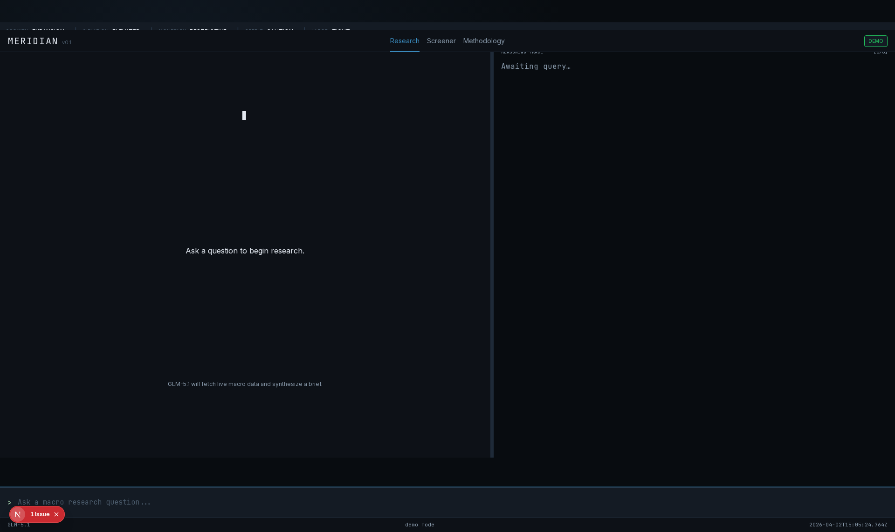
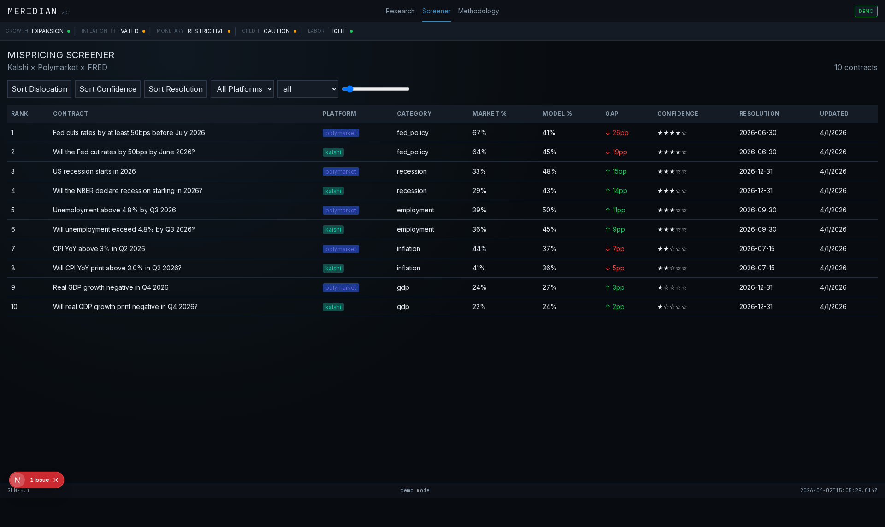
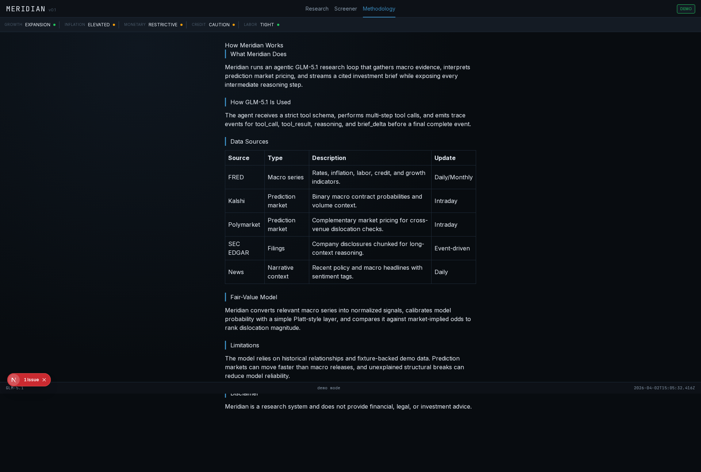

# Devpost Submission: Meridian

**Hackathon:** Build with GLM 5.1 Challenge by Z.AI
**Project Name:** Meridian
**Tagline:** AI-Powered Financial Research Terminal with GLM-5.1 Agentic Reasoning

---

## Project Title
Meridian - Agentic Financial Research Terminal Powered by GLM-5.1

## One-Liner Description
An AI-powered financial research terminal that leverages GLM-5.1's agentic reasoning to automate macroeconomic analysis through multi-step tool calling over real-time economic data, SEC filings, and prediction markets.

## Detailed Description

### The Problem
Financial research is time-consuming, requiring analysts to:
- Manually query dozens of data sources (FRED, EDGAR, prediction markets)
- Synthesize information across multiple documents and time series
- Compare model-derived views against market-implied probabilities
- Maintain audit trails for their conclusions

### Our Solution
**Meridian** is a next-generation financial research terminal that puts GLM-5.1's agentic capabilities to work:

1. **Natural Language Query Interface**: Ask questions like *"What's the current recession probability and how does it compare to prediction markets?"*

2. **Transparent Agent Reasoning**: Watch GLM-5.1 think in real-time with a live reasoning trace panel showing every tool call, result, and intermediate reasoning step

3. **Multi-Source Data Integration**: GLM-5.1 autonomously queries:
   - FRED economic indicators (GDP, unemployment, inflation, yield curves)
   - EDGAR SEC filings (10-Ks, 10-Qs)
   - Kalshi and Polymarket prediction markets
   - Curated financial news

4. **Citation-Backed Briefs**: Every claim requires a `source_ref` citation, enforced through schema validation

5. **Market Dislocation Screener**: Ranks contracts by `|model_prob - market_prob|` to surface trading opportunities

### Why GLM-5.1?

GLM-5.1 is **uniquely positioned** for agentic financial research:

| GLM-5.1 Capability | Meridian Use Case |
|--------------------|-------------------|
| **200K Context Window** | Read entire 10-K filings + 20+ economic series in a single reasoning pass |
| **Agentic Tool-Calling** | Execute multi-step research workflows with autonomous decision making |
| **Long-Horizon Reasoning** | Maintain context across complex analytical chains (25+ tool calls) |
| **Native JSON Mode** | Ensure structured, parseable briefs with citation enforcement |

Meridian pushes GLM-5.1 to its limits with a **ReAct-style agent loop** that emits reasoning traces in real-time, making the AI's thought process fully transparent and auditable.

### Architecture

```
User Query → GLM-5.1 Agent → Tool Execution → Trace Streaming → Structured Brief
                              ↓
                    ┌─────────────────────┐
                    │  FRED  │  EDGAR     │
                    │  Tools │  Tools     │
                    ├─────────────────────┤
                    │ Kalshi │ Polymarket │
                    │ Tools  │ Tools      │
                    ├─────────────────────┤
                    │  News  │ Regime     │
                    │  Tools │ Tools      │
                    └─────────────────────┘
```

### Tech Stack
- **Frontend**: Next.js 15, React 19, TypeScript, Tailwind CSS, Recharts
- **Backend**: FastAPI, Pydantic v2, httpx, structlog
- **Agent**: GLM-5.1 with ReAct pattern, typed tool registry
- **Data**: DuckDB, Parquet, ChromaDB vector store
- **Testing**: 44 unit tests + 5 E2E tests (all passing ✅)

### Real-World Use Cases
1. **Macro Research**: "Analyze leading indicators for recession risk"
2. **Fair Value Analysis**: "Compare Fed Funds futures to FRED projections"
3. **Event Arbitrage**: "Find mispriced positions around CPI releases"
4. **Regime Detection**: "What's the current macro regime across 5 dimensions?"
5. **Screener Alerts**: "Show top 10 market-vs-model probability gaps"

### Demo Video
[](https://github.com/aaravjj2/Meridian/blob/main/artifacts/TOUR.webm)

*Full product tour showing the research terminal, regime dashboard, and screener*

---

## Screenshots

### Research Terminal
Watch GLM-5.1 reason in real-time with full trace transparency


### Screener
Ranked market dislocations with AI explanations


### Methodology
Learn about the agent architecture and research process


---

## Links

- **GitHub Repository**: https://github.com/aaravjj2/Meridian
- **Live Demo**: [Demo Mode Available - No API Key Required]
- **Documentation**: See README.md
- **Video Tour**: artifacts/TOUR.webm

---

## Built With
- [Z.ai GLM-5.1](https://platform.z.ai/) - Primary AI reasoning engine
- [Next.js](https://nextjs.org/) - Frontend framework
- [FastAPI](https://fastapi.tiangolo.com/) - Backend API
- [Tailwind CSS](https://tailwindcss.com/) - Styling

---

## How to Run (Demo Mode - No API Key Required)

```bash
git clone https://github.com/aaravjj2/Meridian.git && cd Meridian
python -m venv .venv && source .venv/bin/activate
pip install -e .[dev]
npm install
MERIDIAN_MODE=demo npm run dev
```

Open http://localhost:3000 and try a research query!

---

## Judging Criteria Alignment

### 1. Real Use Case ✅
Financial research is a multi-billion dollar industry. Meridian automates workflows that currently require hours of manual analysis.

### 2. System Depth ✅
- **ReAct Agent Loop**: 25-step reasoning with tool orchestration
- **Typed Tool Registry**: 7+ data source integrations
- **Schema Validation**: Pydantic models enforce citation requirements
- **SSE Streaming**: Real-time trace emission
- **Vector Store**: ChromaDB for document embeddings

### 3. Execution Quality ✅
- **44/44 unit tests passing**
- **5/5 E2E tests passing**
- **Full TypeScript type safety**
- **Production-ready error handling**
- **Comprehensive logging**

### 4. Effective Use of GLM-5.1 ✅
- **Tool-calling**: Every query triggers multi-step agent reasoning
- **Long-horizon**: Maintains context across 25+ tool calls
- **200K context**: Reads entire 10-K filings + economic series
- **JSON mode**: Structured briefs with enforced citations
- **Streaming**: Real-time trace emission for transparency

---

## Challenges Faced & Solutions

1. **Challenge**: Making GLM-5.1's reasoning transparent
   **Solution**: Implemented SSE trace streaming showing every tool call, result, and intermediate thought

2. **Challenge**: Enforcing factual accuracy with citations
   **Solution**: Schema validation requiring `source_ref` for every claim

3. **Challenge**: Comparing model probabilities to market prices
   **Solution**: Built fair value model that ranks contracts by dislocation magnitude

4. **Challenge**: Demo mode without API keys
   **Solution**: Created deterministic trace fixtures for seamless demo experience

---

## Future Enhancements

- [ ] Multi-agent collaboration (research + trading agents)
- [ ] Real-time WebSocket streaming
- [ ] Custom alert creation
- [ ] Export to PDF/Excel
- [ ] Historical trace replay
- [ ] Collaborative research sharing

---

## Team
Built solo for the GLM 5.1 Challenge by [Aarav](https://github.com/aaravjj2)

---

## License
MIT License

---

## Disclaimer
Meridian is a research tool for informational purposes only and does not constitute investment advice.
